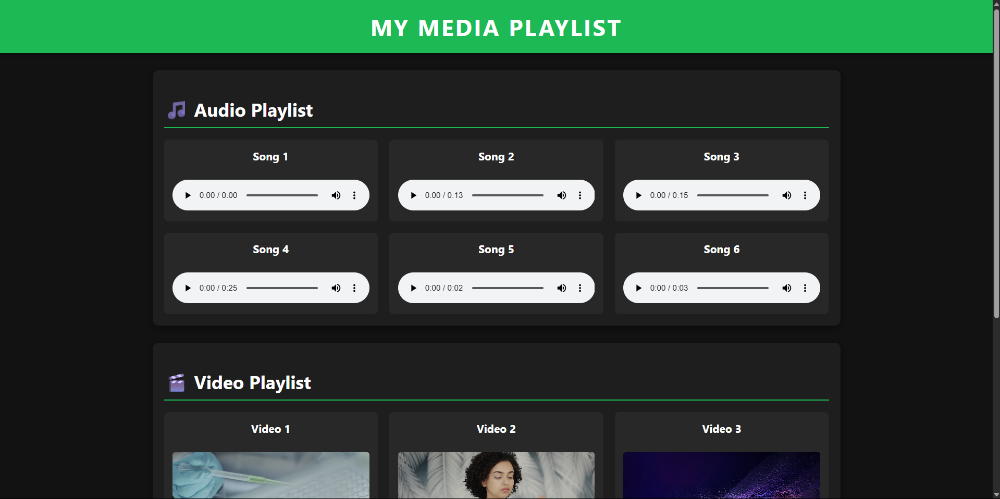

# Sigma Web Development - Exercise 1: HTML & CSS Media Player

This is my solution for Exercise 1 of the Sigma Web Development course by CodeWithHarry. The goal was to build a simple media player page using only pure HTML and then style it with CSS.

---

## 🚀 Project Overview

This project demonstrates the use of fundamental HTML5 tags like `<audio>` and `<video>` to embed media. It also includes a custom stylesheet to create a modern, dark-themed, and responsive layout for the media playlists.

## ✨ Features

- **Clean Interface:** A modern dark theme for comfortable viewing.
- **Organized Playlists:** Separate sections for audio and video files.
- **Responsive Grid:** The layout adjusts automatically to different screen sizes.
- **Interactive Hover Effects:** Media items lift up on hover for a dynamic feel.
- **Smooth Animations:** Subtle fade-in animations for a polished user experience.

## 🛠️ Tech Stack

- **HTML5:** For the structure and media elements.
- **CSS3:** For styling, layout (Flexbox/Grid), and animations.

## 🎓 What I Learned

- How to use the `<audio>` and `<video>` tags effectively.
- How to structure a webpage semantically.
- Advanced CSS styling including Grid layout for responsiveness.
- Adding transitions and animations to make the user experience more engaging.
- The basics of setting up a project and pushing it to GitHub.

## 🙏 Acknowledgements

- A big thank you to **CodeWithHarry** for the amazing [Sigma Web Development Course](https://www.youtube.com/playlist?list=PLu0W_9lII9agq5TrH9XLIKQvv0iaF2X3w).
